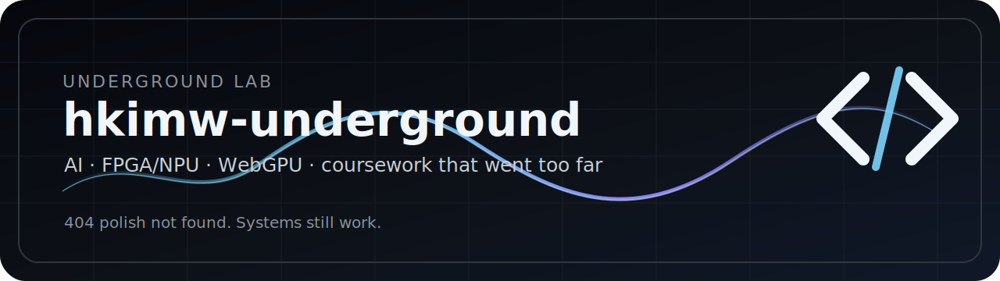
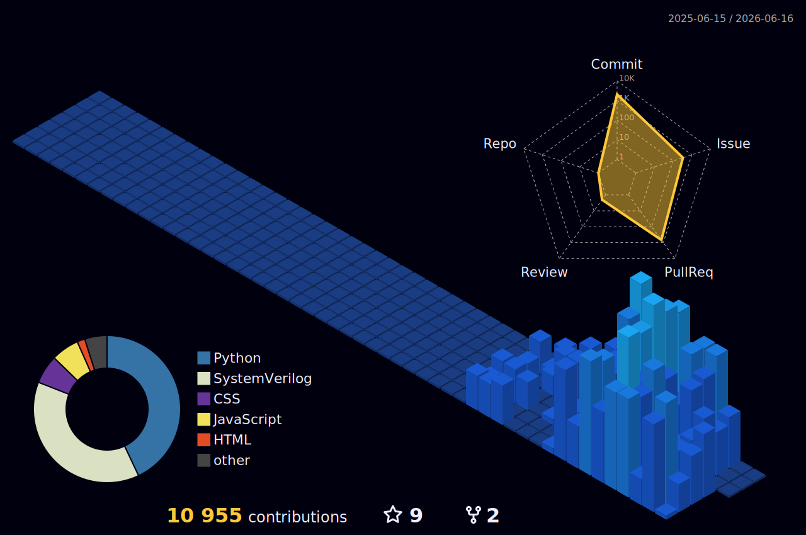

<p align="center">
  
</p>

<h1 align="center">👻 CODE LIFE.exe / hkimw-underground 🧪</h1>

<p align="center">
  
</p>

<p align="center">
  <a href="https://github.com/hkimw"></a>
  <a href="https://github.com/hwkim-dev"></a>
  
  
  
  
</p>

<p align="center">
  
  
  
  
  
  
  
</p>

---

<table>
<tr>
<td width="25%" valign="top">

### 👻 mascot

```txt
 CODE LIFE
  .----.
 / □  □ \   helmet: ON
|  __   |   coffee: IV
|  ⚒    |   polish: 404
 \____/    vibe: noisy
```

</td>
<td width="25%" valign="top">

### 🧪 gauges

| meter | value |
| --- | ---: |
| weird | `MAX` |
| useful | `maybe` |
| clean | `no` |
| alive | `yes` |
| docs | `loud` |
| UI | `too much` |

</td>
<td width="25%" valign="top">

### 🧫 specimens

| jar | state |
| --- | --- |
| bugs | pets |
| demos | awake |
| graphs | glowing |
| badges | leaking |
| ideas | loud |
| TODO | multiplying |

</td>
<td width="25%" valign="top">

### 🖥️ console

```bash
$ ./lab
OK  badge++
OK  graph++
OK  widget++
WARN normal--
```

</td>
</tr>
</table>

---

## 🧨 WIDGET WALL

<p align="center">
  
</p>

<p align="center">
  
</p>

<table>
<tr>
<td width="50%" valign="top">


</td>
<td width="50%" valign="top">


</td>
</tr>
<tr>
<td width="50%" valign="top">


</td>
<td width="50%" valign="top">


</td>
</tr>
</table>

---

## 🧬 MUTATION MATRIX

<table>
<tr>
<td width="50%" valign="top">

<p align="center">
  
</p>

</td>
<td width="50%" valign="top">

<p align="center">
  <a href="https://github.com/hkimw-underground">
    
  </a>
</p>

</td>
</tr>
</table>

---

## 🧪 TUBE RACK

<p align="center">
  <a href="https://skillicons.dev">
    
  </a>
</p>

<table>
<tr>
<td align="center">🟦<br/><b>RTL</b><br/><sub>wires everywhere</sub></td>
<td align="center">🟪<br/><b>NPU</b><br/><sub>bottleneck pet</sub></td>
<td align="center">🟩<br/><b>WebGPU</b><br/><sub>browser furnace</sub></td>
<td align="center">🟨<br/><b>Docs</b><br/><sub>poster mode</sub></td>
<td align="center">🟥<br/><b>Backend</b><br/><sub>green slime API</sub></td>
<td align="center">⬛<br/><b>CLI</b><br/><sub>terminal goblin</sub></td>
</tr>
</table>

---

## 🧟 PROJECT ZOO

<table>
<tr>
<td width="25%" valign="top">

### 🔐 doorlock thing
`digital-logic-circuit`

NFC · PIN · face · ESP32-CAM · FastAPI · SQLite

`scope: escaped`

</td>
<td width="25%" valign="top">

### 📚 report beast
`Latest-Research-Trends-in-AI`

XeLaTeX · TikZ · slides · reusable chaos

`status: contained`

</td>
<td width="25%" valign="top">

### 🧦 socket fossil
`Csharp-Socket-Server`

old server. still breathing.

`touch: no`

</td>
<td width="25%" valign="top">

### 🧠 C notebook
`datastructure_algorithm`

pointers, lists, trees, exam panic

`state: rough`

</td>
</tr>
</table>

---

## 🎛️ CHAOS BOARD

<table>
<tr>
<td width="20%" align="center">🧯<br/><b>normal UI</b><br/><code>disabled</code></td>
<td width="20%" align="center">🧃<br/><b>coffee tank</b><br/><code>98.7%</code></td>
<td width="20%" align="center">📟<br/><b>badge reactor</b><br/><code>hot</code></td>
<td width="20%" align="center">🐛<br/><b>bug hotel</b><br/><code>occupied</code></td>
<td width="20%" align="center">🌀<br/><b>README swirl</b><br/><code>spinning</code></td>
</tr>
<tr>
<td width="20%" align="center">📡<br/><b>graph radar</b><br/><code>noisy</code></td>
<td width="20%" align="center">🧬<br/><b>mutation</b><br/><code>stable-ish</code></td>
<td width="20%" align="center">🧪<br/><b>lab tubes</b><br/><code>glowing</code></td>
<td width="20%" align="center">🚧<br/><b>prototype lane</b><br/><code>open</code></td>
<td width="20%" align="center">👻<br/><b>ghost boss</b><br/><code>watching</code></td>
</tr>
</table>

---

## KR

설명 줄임. 위젯 늘림. 정상적인 첫인상 포기함.

여기는 포트폴리오보다 **놀이터**, 문서보다 **제어판**, 정리보다 **실험 로그** 쪽에 가깝다.

```txt
작게 만들기 -> 바로 올리기 -> README 붙이기 -> 이상한 위젯 추가 -> 살아남으면 승급
```

---

## EN

Less explanation. More widgets. First impression intentionally overloaded.

This is a playground, not a polished shelf. Small builds, loud README, weird dashboards, surviving prototypes.

```txt
build small -> ship weird -> add widgets -> keep survivors
```

---

<a id="secret-panel"></a>

## 🕳️ EXTRA DRAWERS

<details>
<summary>open drawer 01</summary>

```txt
README_STATUS = SENTIENT
BADGE_REACTOR = HOT
GHOST_MASCOT = EMPLOYED
NORMAL_DESIGN = NOT_FOUND
```

</details>

<details>
<summary>open drawer 02</summary>

| weird feature | status |
| --- | --- |
| repo survival dashboard | queued |
| bug diary SVG | queued |
| coffee meter | queued |
| experiment log generator | queued |
| README chaos generator | queued |
| prototype promotion board | queued |

</details>

---

<p align="center">
  
</p>
